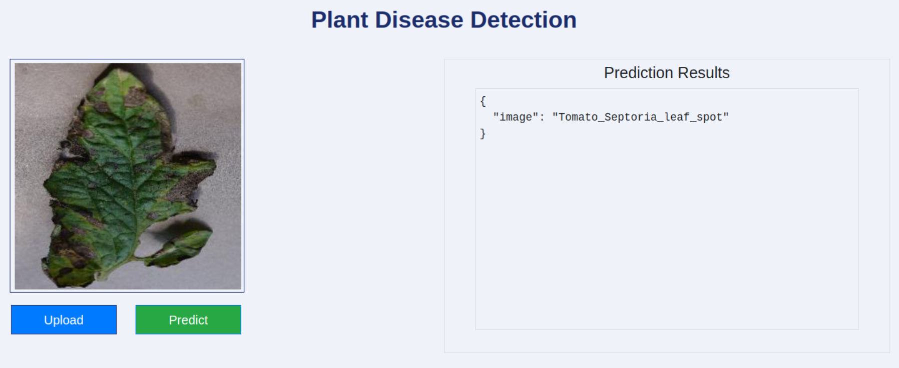
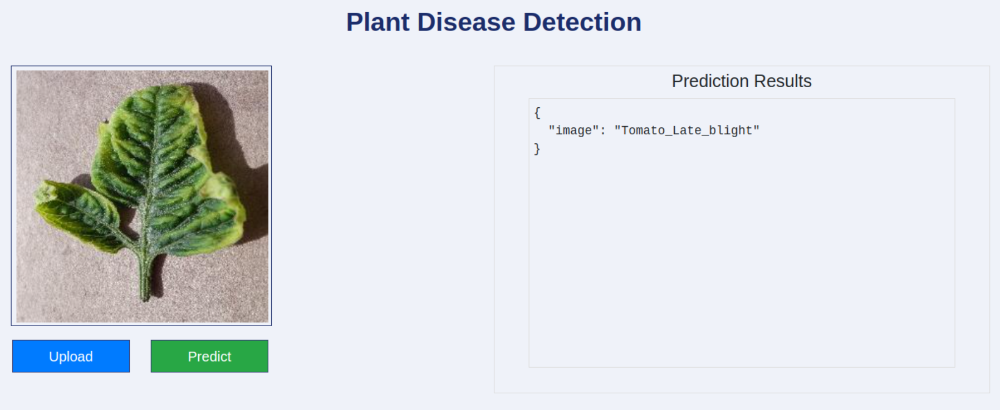

# <div align='center'>Plant Disease Detection 🚀</div>


## Examples

&nbsp;



## Workflows

1. Update config.yaml
2. Update secrets.yaml [Optional]
3. Update params.yaml
4. Update the entity
5. Update the configuration manager in src config
6. Update the components
7. Update the pipeline 
8. Update the main.py


## Dataset

* You can use any dataset (including the Kaggle dataset) that is supported by [opendatasets](https://github.com/JovianHQ/opendatasets). Just place the URL of the dataset in `config/config.yaml/data_ingestion/source_URL` 
* If you want to use your custom dataset, just place it inside the `artifacts/data_ingestion/dataset` folder or any other custom folder that you have to mention in `config/config.yaml/data_ingestion/dataset_dir` 


## <div style="padding-top: 20px" align="center"> Steps to run </div>

<div style="padding-bottom:10px"><b>STEP 00 :</b> Clone the repository</div>

```bash
https://github.com/utpal108/waste-detection-using-yoloV5
```
<div style="padding-top:10px"><b>STEP 01 :</b> Create a virtial environment after opening the repository</div>

Using Anaconda Virtual Environments

```bash
conda create -n venv python=3.10 -y
conda activate venv
```
Or for Linux operating system, you can use that

```bash
python3.10 -m venv venv
source venv/bin/activate
```

<div style="padding-top:10px; padding-bottom:10px"><b>STEP 02 :</b> Install the requirements</div>

```bash
pip install -r requirements.txt
```
For downloading the Kaggle dataset, place the `kaggle.json` file (Kaggle API credentials) in your root directory.

Finally, run the following command to run your application:
```bash
python app.py
```

<div style="padding-top:10px"><b>STEP 03 :</b> Run the application</div>

Now,open up your local host with a port like that on your web browser.
```bash
http://localhost:8080
```
<div style="padding-top:10px"><b>STEP 04 :</b> Train the model</div>

Before predicting, you have to train your model with your own dataset.
```bash
http://localhost:8080/train
```
After completing the training, you can now detect any plant disease from the plant leaf image, according to your training datasets.


## <div style="padding-top: 20px" align="center"> AWS CICD Deployment With Github Actions </div>


**STEP 00 :** Login to AWS console.

**STEP 01 :** Create IAM user for deployment

	#with specific access

	1. EC2 access : It is virtual machine

	2. ECR: Elastic Container registry to save your docker image in aws


	#Description: About the deployment

	1. Build docker image of the source code

	2. Push your docker image to ECR

	3. Launch Your EC2 

	4. Pull Your image from ECR in EC2

	5. Lauch your docker image in EC2

	#Policy:

	1. AmazonEC2ContainerRegistryFullAccess

	2. AmazonEC2FullAccess

	
**STEP 02 :** Create ECR repo to store/save docker image

    - Save the URI: 681776806933.dkr.ecr.us-east-2.amazonaws.com/plant-disease-detection

	
**STEP 03 :** Create EC2 machine (Ubuntu) 

**STEP 04 :** Open EC2 and Install docker in EC2 Machine:
	
	
	#optinal

	sudo apt-get update -y

	sudo apt-get upgrade
	
	#required

	curl -fsSL https://get.docker.com -o get-docker.sh

	sudo sh get-docker.sh

	sudo usermod -aG docker ubuntu

	newgrp docker
	
**STEP 05 :** Configure EC2 as self-hosted runner:
    setting>actions>runner>new self hosted runner> choose os> then run command one by one

**STEP 06 :** Setup github secrets:

    AWS_ACCESS_KEY_ID=

    AWS_SECRET_ACCESS_KEY=

    AWS_REGION = us-east-2

    AWS_ECR_LOGIN_URI = demo>>  681776806933.dkr.ecr.us-east-2.amazonaws.com

    ECR_REPOSITORY_NAME = plant-disease-detection